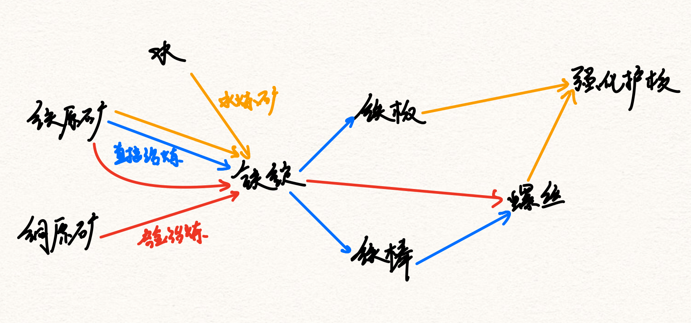
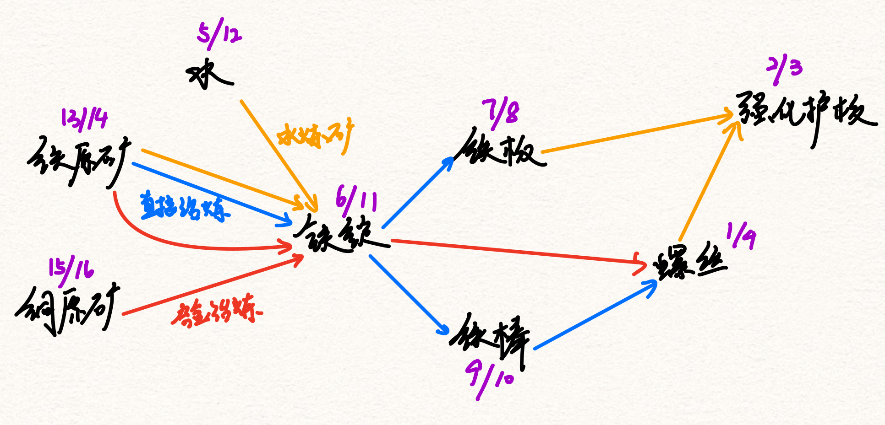

# 幸福工厂 量化计算器

### Core Idea

核心原理来自线性代数中的Incident Matrix

https://www.bilibili.com/video/BV16Z4y1U7oU?p=12

对于这个矩阵，每一行代表一个配方，每一列代表一种资源，比如使用铁原矿生成强化铁板的Matrix表示应该是

| 配方名称 | 铁原矿 | 铁锭 | 铁板 | 铁棒 | 螺丝 | 强化护板 |
| ---- | ---- | --- | ---- | ---- | ---- | ---- |
| Iron Ingot | -30 | 30 | 0 | 0 | 0 | 0 |
| Iron Plate | 0 | -30 | 20 | 0 | 0 | 0 |
| Iron Rod | 0 | -15 | 0 | 15 | 0 | 0 |
| Screw | 0 | 0 | 0 | -10 | 40 | 0 |
| Reinforced Iron Plate | 0 | 0 | -30 | 0 | -60 | 5 |

其中的数据代表一台生产设备点位时间的产量（这里是1分钟）

这个矩阵构成一个Incident Graph，而我们需要“配平”整个系统，也就是，找到每种配方所需的数量，使得最后的产出只有我们需要的物品，其它的产出都是0，即
$$
A^Tx = b
$$
A 为上面的Incident Matrix，x为我们所需要的配平向量，b为经过配平后的各个产物的数量

因此我们可以得到$x = inv(A^T)*b$

然而，上面给出的$A^T$不是invertable的，它甚至不是一个square matrix，因此我们需要将它变成一个square matrx

我们可以手动加入一行输入，以达到square matrix的效果。事实上，只要能够补充所有的原矿输入行，即可将任意生产系统变成square matrix

| 配方名称              | 铁原矿 | 铁锭 | 铁板 | 铁棒 | 螺丝 | 强化护板 |
| --------------------- | ------ | ---- | ---- | ---- | ---- | -------- |
| Iron Ingot            | -30    | 30   | 0    | 0    | 0    | 0        |
| Iron Plate            | 0      | -30  | 20   | 0    | 0    | 0        |
| Iron Rod              | 0      | -15  | 0    | 15   | 0    | 0        |
| Screw                 | 0      | 0    | 0    | -10  | 40   | 0        |
| Reinforced Iron Plate | 0      | 0    | -30  | 0    | -60  | 5        |
| [Input]Iron Ore       | 1      | 0    | 0    | 0    | 0    | 0        |

输入行除了输入的物品为1，剩下的项都是0，稍后可以看到这样做的优势。假设我们需要每分钟产出60强化护板
$$
inv(\left[ { \begin{matrix}
-30 & 30 & 0 & 0 & 0 & 0 \\
0 & -30 & 20 & 0 & 0 & 0 \\
0 & -15 & 0 & 15 & 0 & 0 \\
0 & 0 & 0 & -10 & 40 & 0 \\
0 & 0 & -30 & 0 & -60 & 5 \\
1 & 0 & 0 & 0 & 0 & 0
\end{matrix} } \right]^T)
*
\left[ { \begin{matrix}
0 \\ 0 \\ 0 \\ 0 \\ 0 \\ 60
\end{matrix} } \right]
= \left[ { \begin{matrix}
24 \\ 18 \\ 12 \\ 12 \\ 18 \\ 720
\end{matrix} } \right]
$$
得到的结果可以理解为"需要24台机器生产配方Iron Ingot", "18台机器生产配方Iron Plate" ......

而最后的一行代表需要铁原矿的输入为720/min，由于我们在矩阵中加入的是单位1，因此这里直接就能得到输入速率

### 多配方处理

Satisfactory中，各种物品的生产配方意外的杂乱，同一种物品往往有多个配方，比如螺丝就有两个配方

| 配方名称           | 铁锭 | 铁棒 | 螺丝 |
| ------------------ | ---- | ---- | ---- |
| Screw              | 0    | -10  | 40   |
| Screw (Iron Ingot) | -10  | 0    | 40   |
| Iron Rod           | -15  | 15   | 0    |

当然，由于铁棒是铁锭来的，这个替代配方无条件碾压默认配方，但这不是计算器要关注的问题

计算器关注的是Incident Matrix是否Invertable。毫无疑问，如果有两种配方能够生产同一种物质，且没有其他副产物限制，是无法进行配平的。逻辑上讲，计算器无法知道配方1与配方2的比例，只知道他们两个一共需要产生某个量的产物。

从线性代数的角度，不难发现，上面的矩阵的转置$A^T$是Linear Dependent的，也就是说如果这三个配方同时存在，我们的系统将会无解。（有Free Variable）

由此引出计算器的另一核心功能，对生产路径的查询。对于所有产线游戏来说，各个资源之间构成一个Directional Graph。于是可以生成一张图来保存所有物品之间的关系。

### 生产关系的有向图表示

面临的挑战之一便是两个物资之间并不总是简单的链接关系，它们的链接有时需要第三者的参与。比如强化护板的生产需要同时有铁板和铁棒按一定比例加入。解决方案是对这张图中的每一个Edge，都保存一个“配方名称”。这样同时解决了复杂配方（多产物+多合成物）和多配方的问题（各个配方互不干扰）。

那么得到invertable matrix的问题便转化成了从完整的资源图中提取一颗树，这棵树中，生产每种物资时只能有唯一配方。图中也能很好的辨认Input Node -> 入度为0的节点在矩阵中需要添加输入行。

### 结果的展示

绘制结果图时，尽量能够按照生产顺序来展示。因此我们直接对图进行拓扑排序，一个排序的例子可以参考下图（当有多个选项时，按照Lexigraphical Order由小到大选择。

拓扑排序的结果是：铜原矿，铁原矿，水，铁锭，铁棒，铁板，螺丝，强化护板

当两种相邻物资之间不存在任何边时，他们两个便是一个Tier中的。当存在后向边/树边时(A->B)，则B比A多一Tier。

上图的例子就会变为[铜原矿，铁原矿，水], [铁锭], [铁棒，铁板], [螺丝], [强化护板]

通过线性代数的结果结合配方即可计算出图中每条边实际的货物流量，通过UI显示即可

### 不同生产路径的比较

对于各个生产游戏来说，“生产速度”，“空间”（机器占地面积），“资源消耗”（电力，原料）一般构成一个不可能三角，只能同时提升两个，而代价是降低另一项。

在我们的计算器中，其实控制了“生产速度”这个变量。因此我们实际的指标变为“优化空间”，“优化电力”或“优化原料-产物比例”

优化空间和电力比较Trival，我们通过线代得到的Vector里面包含着机器的数量，并且配方中明确写出了机器的耗电量。

对于资源，我们需要一个打分系统来评估资源的价值，可以直接使用Satisfactory Wiki中的方案

https://satisfactory.fandom.com/wiki/Hard_Drive#Alternate_recipe_analysis

对每个资源赋予"Weighted Point"，WP = (resource consumption rate/maximum extration rate) * 10000

WP值越小代表某种物资越不珍贵，对于无限速率采集的水，WP = 0

有了打分系统即可直接计算原材料的价值来评估某一配方

> Satisfactory这样计算是因为矿物资源无限，但产率受限
>
> 其他的产线游戏比如戴森球这样矿物资源量受限的需要其它计算方式

### Initial Value Problem 与 Boundry Value Problem （雾

在实际应用中，生产配方的选用往往受限于手中可用的资源。在设计工厂时往往也有两种approach

##### 第一种 - 我只想生产某个特定物资，且只能用我手头的这些给定的资源

这种类似微分方程中的Boundry Value Problem，给定了原材料与结果，需要用图算法找到一条/多条可行的道路

一种approach是直接计算所有的可能方案，然后筛选出不合理的。（由于计算器本身使用频率不大，而且算法已经够快了，没太大必要进行针对优化）

##### 第二种 - 我这片区域有这些资源，我想生产所有可以产出的东西

这种就类似Initial Value Problem，在图中从某几个节点开始向外发散，直到生产出所有可能生产的物资，再生产其它任何物资都需要新资源的供应。

### 运输方式的选择（TODO）
